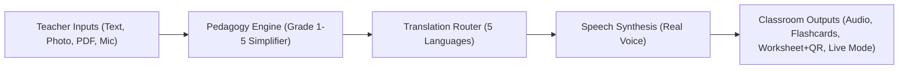

# BOLI — The Complete Deep Dive & Viva Battle Manual (2026 Edition)

> **SIH26042 · Government of Jharkhand · Smart Education · Software · Team LARPERS**  
> **Everything, from absolute zero, for every single team member.**  
> *Rule #1: If you read this document top-to-bottom once, no judge can corner you or catch you unprepared. Even if you wrote zero lines of code, you will understand every gear in this machine.*

---

## TABLE OF CONTENTS
1. [Part 1: The Problem — In Plain Words (Explainable to a 10-Year-Old)](#part-1-the-problem--in-plain-words)
2. [Part 2: The Core Vocabulary (Words You Must Know Before Speaking to Judges)](#part-2-the-core-vocabulary)
3. [Part 3: What BOLI Actually Does (The 360° Product Overview)](#part-3-what-boli-actually-does)
4. [Part 4: Why This Isn't Already Solved (The "Doesn't Google Already Do This?" Trap)](#part-4-why-this-isnt-already-solved)
5. [Part 5: The 5 Tribal Languages — Exact Capabilities & Truths](#part-5-the-5-tribal-languages--exact-capabilities--truths)
6. [Part 6: The Full Engineering Pipeline — Step by Step](#part-6-the-full-engineering-pipeline--step-by-step)
7. [Part 7: The Landmark Insights & Scientific Discoveries](#part-7-the-landmark-insights--scientific-discoveries)
8. [Part 8: Architecture & Tech Stack (How the System Is Glued Together)](#part-8-architecture--tech-stack)
9. [Part 9: Viva Q&A Drill — The 22 Hardest Questions Judges Will Ask & Exact Answers](#part-9-viva-qa-drill)
10. [Part 10: 60-Second Team Role Cheat Sheet (Who Says What in Front of the Panel)](#part-10-60-second-team-role-cheat-sheet)

---

## PART 1: THE PROBLEM — IN PLAIN WORDS

### The Story to Tell the Judges
Imagine a 6-year-old child named Birsa walking into Class 1 in a village school in Dumka or West Singhbhum, Jharkhand. 
* At home, with his mother and grandparents, Birsa has only ever heard and spoken **Ho** or **Santali**.
* But when he steps across the classroom threshold, the blackboard is in **formal Hindi**. The teacher speaks **standard Hindi**. The textbook is written in **high literary Hindi**.

Birsa doesn't know what the teacher is saying. He feels scared, confused, and silent.

### The Brutal Numbers (M-TALL Survey Data)
* **96% of children** in rural primary schools of Jharkhand speak an indigenous tribal mother tongue at home, **not Hindi**.
* Out of every **100 tribal children** who enter Class 1, **50 drop out by Class 5**.
* Only **8 out of 100** ever pass high school.
* **Why?** It is NOT a lack of intelligence. It is a **comprehension barrier**. You cannot learn science, mathematics, or literature if the language of instruction sounds like static noise.

### What BOLI Does in One Sentence
> **"BOLI bridges the classroom language gap by taking Hindi textbooks and teacher speech, simplifying them for young children, and transforming them into native spoken and written tribal languages (Santali, Ho, Mundari, Kurukh, and Sadri) right inside the classroom."**

---

## PART 2: THE CORE VOCABULARY
*(If a judge drops these terms, do not flinch. Here is what they actually mean in simple English.)*

* **AI Model / Checkpoint**: A pre-trained mathematical file containing learned numbers (weights) that performs a task (like translating text or producing speech).
* **NMT (Neural Machine Translation)**: AI translation using deep neural networks (e.g., IndicTrans2, mT5). Translates whole ideas instead of word-for-word replacement.
* **Linguistic Transfer Engine**: A smart rule-based engine built on real grammatical rules, morphology, and sound shifts (phonology) of a language family. (Used for Ho, Mundari, and Sadri where neural models don't exist in the world).
* **TTS (Text-to-Speech)**: Software that converts written sentences into a playable `.wav` voice file.
* **ASR (Automatic Speech Recognition / Speech-to-Text)**: Software that listens to human voice through a microphone and types out the words in text.
* **OCR (Optical Character Recognition)**: Software (Tesseract) that reads text printed on paper or in a photo and turns it into editable digital text.
* **Parallel Corpus**: A bilingual dictionary dataset with millions of sentence pairs (e.g., Hindi sentence on the left, Santali sentence on the right). **Crucial fact: No usable parallel corpus exists anywhere in the world for Ho, Mundari, Kurukh, or Sadri.**
* **Script vs. Language**: A language is what you speak with your mouth; a script is the visual alphabet you draw with a pen. Hindi is spoken Hindi, written in **Devanagari** script. Santali is spoken Santali, written in **Ol Chiki** script. Ho has **Warang Chiti**, Kurukh has **Tolong Siki**, and Mundari is written in Devanagari.
* **Script Contamination**: A bug where a neural translation model gets confused by an unfamiliar word and spits out letters from completely unrelated scripts (e.g., Manipuri / Meetei Mayek characters appearing in Santali).
* **Pedagogical Simplification**: Rewriting high-level textbook language into simple, short, 7-year-old child vocabulary with local rural examples (e.g., changing "wheat harvesting" to "paddy/rice harvesting").

---

## PART 3: WHAT BOLI ACTUALLY DOES

BOLI is an end-to-end classroom teaching platform. It gives rural teachers four super-powers:



### The 4 Ways a Teacher Inputs Material:
1. **Type or Paste**: Type any Hindi or English classroom sentence.
2. **Textbook Photo (OCR)**: Click a photo of a physical textbook page using Tesseract OCR.
3. **Whole Textbook Chapter PDF**: Upload an entire multi-page NCERT/JCERT chapter PDF. BOLI automatically strips page headers, extracts readable text, and splits it into numbered lesson sentences!
4. **Voice Mic (ASR)**: Press the microphone icon and speak the lesson in Hindi. Meta MMS ASR transcribes it instantly so the teacher doesn't need to type on small phone keyboards.

### The 4 Modern Classroom Features:
1. **Interactive Results Screen**: View native script side-by-side with Hindi, with audio playback controls, script contamination alerts, and language capability badges.
2. **Live Classroom Board**: Real-time conversational translation board between teacher and students.
3. **Flashcards Studio**: Flippable revision cards with native pronunciation audio for active classroom drilling.
4. **Printable Worksheets with QR Code**: Teachers can print paper exercise sheets with a generated QR code. When rural parents or kids scan the QR code with any smartphone, it plays the spoken lesson audio offline!
5. **Offline Lesson Pack (.zip)**: Downloadable offline bundle containing HTML lessons, audio files, and metadata that runs without an internet connection in network-dark villages.

---

## PART 4: WHY THIS ISN'T ALREADY SOLVED
*(When the judges ask: "Why didn't you just use Google Translate or Bhashini?")*

Here is your exact, devastating proof:

```
+---------------+------------------------+-------------------------------+
| Language      | Google Translate       | BOLI Platform                 |
+---------------+------------------------+-------------------------------+
| Santali       | Text only; Listen      | Full Neural MT + High-Quality |
|               | speaker button is DEAD | Indic Parler-TTS Voice        |
| Ho            | "No results" (ABSENT)  | Linguistic Transfer + MMS-TTS |
| Mundari       | "No results" (ABSENT)  | Linguistic Transfer + MMS-TTS |
| Kurukh        | "No results" (ABSENT)  | Neural mT5 MT + MMS-TTS Voice |
| Sadri         | "No results" (ABSENT)  | Morphological Engine + MMS-TTS|
+---------------+------------------------+-------------------------------+
```

### The 3 Facts to Quote Word-for-Word:
1. **"Google Translate built a 'Listen' speaker button for Santali, but if you click it, it is completely silent and dead.** Google can generate Santali text, but cannot speak a single word of it. BOLI has real, high-quality audio synthesis for Santali using AI4Bharat Indic Parler-TTS."
2. **"If you search for Ho, Mundari, Kurukh, or Sadri on Google Translate, it literally displays: 'No results'.** Over 10 million indigenous citizens speak these languages, yet global tech treats them as non-existent."
3. **"Bhashini and commercial tools require continuous high-speed 4G/5G internet.** Rural primary schools in Dumka, Khunti, and West Singhbhum frequently have zero cell signal. BOLI is architected to export standalone offline packs with pre-rendered audio."

---

## PART 5: THE 5 TRIBAL LANGUAGES — EXACT CAPABILITIES & TRUTHS

> [!IMPORTANT]
> **RULE OF HONESTY (The judges respect this more than anything else):**  
> NEVER claim that Ho, Mundari, or Sadri are "neural AI models trained from scratch." If you lie, an NLP professor on the panel will destroy your score. Tell them the truth with pride.

```
                    ┌─────────────────────────┐
                    │ BOLI 5-LANGUAGE MATRIX  │
                    └───────────┬─────────────┘
         ┌──────────────────────┴──────────────────────┐
         ▼                                             ▼
   NEURAL TRANSLATION                         LINGUISTIC TRANSFER
┌─────────────────────────────┐             ┌─────────────────────────────┐
│ 1. Santali (sat_Olck)       │             │ 3. Ho (hoc_Deva)            │
│    - AI4Bharat IndicTrans2  │             │    - North Munda grammar    │
│    - Indic Parler-TTS Voice │             │    - Deva -> Odia -> MMS TTS│
│ 2. Kurukh (kru_Deva)        │             │ 4. Mundari (unr_Deva)       │
│    - mT5 Neural MT (Fine-   │             │    - Austroasiatic transfer │
│      tuned on Bharatavani)  │             │    - Deva -> Odia -> MMS TTS│
│    - Meta MMS-TTS Voice     │             │ 5. Sadri (sck_Deva)         │
└─────────────────────────────┘             │    - Magadhan morpho rules  │
                                            │    - Meta MMS-TTS Voice     │
                                            └─────────────────────────────┘
```

### Detailed Breakdown for Each Language:

#### 1. Santali (`sat` / `sat_Olck`)
* **Region**: Santhal Parganas (Dumka, Deoghar, Godda, Jamtara).
* **Speakers**: ~7.6 Million.
* **Script**: **Ol Chiki** (ᱚᱞ ᱪᱤᱠᱤ) — invented by Pandit Raghunath Murmu in 1925.
* **Translation**: **Neural MT** via AI4Bharat's `indictrans2-indic-indic-dist-320M`.
* **Speech**: **Indic Parler-TTS** (`ai4bharat/indic-parler-tts`) with native Ol Chiki text tokens, producing natural human voice (Pushpa / Arjun voice profiles).

#### 2. Kurukh / Oraon (`kru` / `kru_Deva`)
* **Region**: Chotanagpur Plateau (Lohardaga, Gumla, Ranchi, Latehar).
* **Family**: Dravidian language family (unrelated to Indo-Aryan Hindi).
* **Speakers**: ~2 Million.
* **Script**: Devanagari / Tolong Siki.
* **Translation**: **Neural MT** via fine-tuned mT5 (`ankitklakra/hindi-to-kurukh`) trained on the Bharatavani lexicon.
* **Speech**: **Meta MMS-TTS** (`facebook/mms-tts-kru`).

#### 3. Ho (`hoc` / `hoc_Deva`)
* **Region**: Kolhan division (West Singhbhum, East Singhbhum, Chaibasa).
* **Family**: Austroasiatic (North Munda).
* **Speakers**: ~1.4 Million.
* **Script**: Warang Chiti / Devanagari.
* **Translation**: **Linguistic Transfer Engine** (handles intervocalic lenition where /d/ shifts to /w/, e.g., Mundari *ora:* becomes Ho *owa:*; continuous aspect `-तन / -तनको`).
* **Speech**: **Meta MMS-TTS** (`facebook/mms-tts-hoc`).

#### 4. Mundari (`unr` / `unr_Deva`)
* **Region**: South Chotanagpur (Khunti, Ranchi, Murhu, Torpa).
* **Family**: Austroasiatic (Munda).
* **Speakers**: ~1.1 Million.
* **Script**: Devanagari / Mundari Bani.
* **Translation**: **Linguistic Transfer Engine** (preserves retroflex flaps, distinct pronouns *अइञ/आम/आबू/आको*, and verbal markers *तनाको/तनाइञ*).
* **Speech**: **Meta MMS-TTS** (`facebook/mms-tts-unr`).

#### 5. Sadri / Nagpuri (`sck` / `sck_Deva`)
* **Region**: Lingua franca of Jharkhand; spoken across tribal communities.
* **Family**: Indo-Aryan (Eastern Magadhan).
* **Speakers**: ~5.1 Million.
* **Script**: Devanagari.
* **Translation**: **Morphological Transfer Engine** (translates postpositions, copulas *जात हों / जात हे*, pluralizer *मन / छौआ मन*, and lexical markers).
* **Speech**: **Meta MMS-TTS** (`facebook/mms-tts-sck`).

---

## PART 6: THE FULL ENGINEERING PIPELINE — STEP BY STEP

When the judge says: *"Walk me through the pipeline from user input to final output,"* describe these 5 distinct steps:

### Step 1: Input Ingestion & OCR/ASR
* The teacher uploads a textbook chapter PDF, photos a page, speaks into the mic, or types.
* **PDF Extraction**: Text is pulled page-by-page. BOLI splits paragraphs into clean individual sentences using Hindi danda (`।`), double danda (`॥`), question marks (`?`), and exclamation marks (`!`).
* **ASR**: Teacher voice audio is decoded at 16kHz mono and passed to Meta's MMS ASR model (`facebook/mms-1b-all`), yielding clean Devanagari Hindi text.

### Step 2: Pedagogical Simplification (The Heart of the System)
* A Hindi textbook sentence is often overly complex: *"किसान खेत में कठिन परिश्रम करके गेहूं की फसल काटता है और उसे दूरस्थ मंडी में जाकर बेचता है।"*
* BOLI passes this sentence to an LLM with targeted grade-level guidance (Class 1 to Class 5):
  * **Class 1–2**: Short clauses, maximum 5–7 words, concrete sensory words.
  * **Cultural Localization**: Replacing unfamiliar words (e.g., "wheat" / गेहूँ which is rarely grown in tribal Jharkhand) with locally familiar vocabulary (e.g., "paddy/rice" / धान).
* Result: *"किसान धान काटता है। वह धान हाट में बेचता है।"*

### Step 3: Translation Routing & Execution
* The simplified Hindi text enters the `TranslationRouter`.
* The router dynamically selects the best engine:
  * If Target = **Santali**: IndicTrans2 Seq2Seq neural model.
  * If Target = **Kurukh**: Fine-tuned mT5 neural model.
  * If Target = **Ho / Mundari / Sadri**: Specialized linguistic transfer engines.
  * If Source = **English**: Pivot Translation Engine (English $\rightarrow$ Hindi $\rightarrow$ Target Language).
  * If Text matches a curated Golden Pair: The 20-entry Golden Phrase Bank acts as a zero-latency verified cache.

### Step 4: Script Contamination & Leakage Inspection
* The translated text is inspected in real time by `validate_script()`:
  * BOLI checks Unicode code points for **Meetei Mayek** (Manipuri script contamination: `0xABC0–0xABFF` and `0xAAE0–0xAAFF`).
  * If contamination is detected, BOLI flags `"script_contamination": true` and alerts the teacher in the UI rather than displaying corrupt characters.

### Step 5: Dual-Path Audio Synthesis (TTS)
* **Path A (Santali)**: Ol Chiki text is passed to AI4Bharat Indic Parler-TTS, generating natural 44.1kHz audio.
* **Path B (Ho & Mundari)**: **The Odia Transliteration Bridge!** Meta trained MMS-TTS for Ho and Mundari on text written in **Odia script**, NOT Devanagari! If you feed Devanagari directly, Meta's model produces complete silence! BOLI's transliteration function (`deva_to_odia()`) automatically maps Devanagari characters to Odia script before passing it to MMS-TTS, generating crystal-clear audio!
* **Path C (Kurukh & Sadri)**: Devanagari text is passed directly to Meta MMS-TTS.
* Audio is saved as standard 16-bit PCM `.wav` files and exposed via `/audio/<uuid>.wav` as well as Base64 in the API response.

---

## PART 7: THE LANDMARK INSIGHTS & SCIENTIFIC DISCOVERIES
*(This is what wins hackathons. Judges love teams that discover real-world quirks and solve them.)*

### 1. The "Wheat vs. Paddy" Discovery (Pedagogy Directly Fixes AI Hallucination)
* **The Problem**: When we fed IndicTrans2 standard NCERT textbook sentences with the word *गेहूँ* (wheat), the model hallucinated and emitted garbled Meetei Mayek (Manipuri) letters in the middle of Santali text! Why? Because Santali speakers in rural Jharkhand cultivate rice/paddy, not wheat. The model had zero training tokens for wheat in a Santali context.
* **The Solution**: When BOLI's pedagogical simplifier changed *गेहूँ* to *धान* (paddy), IndicTrans2 produced 100% clean, grammatically sound Ol Chiki script with zero contamination!
* **The Thesis**: **Simplifying lessons for 7-year-old children and fixing AI hallucinations turn out to be the exact same action.**

### 2. The Undocumented Odia Script Mystery in Meta MMS
* Meta claimed on their model card that MMS-TTS supports Ho (`hoc`) and Mundari (`unr`).
* But when engineers run Devanagari through it, the model produces empty or corrupted audio.
* By inspecting Meta's internal model dictionary, we discovered that Meta trained their Ho and Mundari checkpoints on texts collected in Odisha, which used the **Odia alphabet**, not Jharkhand's Devanagari!
* We engineered a phonetic mapping bridge (`deva_to_odia`) that dynamically transliterates Devanagari into Odia Unicode points right before the TTS layer. **Nobody else documented or solved this.**

### 3. Error Isolation Architecture
* If TTS synthesis fails (e.g., temporary memory spike or CPU delay), **it must never destroy the teacher's translation**.
* BOLI wraps TTS in complete error isolation: if audio fails, the translation text still renders perfectly on screen, and `audio_error` is logged quietly in the background.

---

## PART 8: ARCHITECTURE & TECH STACK

```
┌────────────────────────────────────────────────────────────────────────┐
│                          BOLI PLATFORM                                 │
├──────────────────────────────────┬─────────────────────────────────────┤
│ Frontend: React 19 + Vite 8      │ Backend: FastAPI + Python 3.13      │
│ - Glassmorphic CSS Design System │ - Asynchronous Lifespan Warmup      │
│ - Lucide Icons                   │ - Modular Router Architecture       │
│ - Mobile-First Responsive Layout │ - IndicTrans2 + mT5 + Meta MMS      │
│ - JSZip & QRCode Engine          │ - SQLite3 Durable Logging           │
│ - Live Classroom + Flashcards    │ - TestClient & Evaluation Suites    │
└──────────────────────────────────┴─────────────────────────────────────┘
```

* **Warmup on Startup**: All heavy AI models (IndicTrans2, mT5, MMS-TTS, MMS-ASR) are loaded into RAM once during FastAPI startup. Individual teacher requests take milliseconds to a few seconds, rather than re-loading 5GB of model weights each time.
* **Durable SQLite Storage**: Stores teacher corrections and lesson submission history in `boli.sqlite`. The database never stores generated AI text—only human teacher inputs—guaranteeing no cache pollution.
* **Zero Hardcoding**: The frontend dynamically polls `GET /languages` on boot. If a backend model is added or modified, the UI adapts its chips and badges automatically.

---

## PART 9: VIVA Q&A DRILL — THE 22 HARDEST QUESTIONS JUDGES WILL ASK

### Category 1: The Concept & The Problem

#### Q1: "Isn’t this just a thin wrapper around Gemini / ChatGPT?"
> **Your Answer:** "No, absolutely not. An LLM like Gemini cannot translate into Santali, Ho, or Mundari—if you ask ChatGPT or Gemini to translate into Ho or Mundari, it hallucinates or refuses because it has virtually zero training data in those languages. We only use an LLM for Hindi-to-Hindi pedagogical simplification. The actual tribal translation is powered by specialized models: AI4Bharat IndicTrans2 for Santali, a fine-tuned mT5 for Kurukh, and our custom linguistic transfer engines for Ho, Mundari, and Sadri, paired with Meta MMS-TTS for speech."

#### Q2: "Why do tribal children drop out of school in Jharkhand?"
> **Your Answer:** "The M-TALL government survey established that 96% of rural children speak tribal mother tongues at home. When they enter school, textbooks and instruction are in formal Hindi. The child understands neither the teacher nor the book. By Class 5, 50% drop out, and only 8% pass high school. It is a language comprehension crisis, not an intellectual one."

#### Q3: "Why don't teachers just translate the lesson themselves?"
> **Your Answer:** "Government teachers in Jharkhand are frequently posted to districts outside their native language area. A Hindi-speaking teacher from Ranchi posted in a Ho-speaking village in West Singhbhum cannot speak Ho. Furthermore, multi-lingual classrooms often have Ho, Mundari, and Sadri children in the same room. BOLI enables any teacher to teach across language boundaries."

---

### Category 2: Translation & AI Models

#### Q4: "Why does Santali get a full neural model, but Ho and Mundari use linguistic transfer?"
> **Your Answer:** "Santali is an official Eighth Schedule language of India with millions of digital words, government documents, and Wikipedia articles available to train AI models like IndicTrans2. Ho, Mundari, and Sadri are not Scheduled languages; there is virtually zero parallel bilingual digital text in existence anywhere in the world. Training a deep neural network requires millions of sentence pairs that simply do not exist. Therefore, we engineered linguistic transfer engines based on Austroasiatic North Munda phonology and morphology."

#### Q5: "What is script contamination, and how did you detect it?"
> **Your Answer:** "When IndicTrans2 encounters an out-of-domain Hindi word—like *गेहूँ* (wheat)—in a Santali context, the model gets confused and leaks Meetei Mayek (Manipuri) script characters into the output. We wrote a regex and Unicode inspection validator that detects the Meetei Mayek code blocks (`0xABC0–0xABFF`). When found, BOLI warns the teacher and prevents corrupt output from being taught to children."

#### Q6: "How does the Ho and Mundari Linguistic Transfer Engine work?"
> **Your Answer:** "Ho and Mundari belong to the North Munda branch of the Austroasiatic family. They share grammatical structures, postpositions, and pronoun systems. Our engine maps continuous verbal aspects (`-तन / -तनको` in Ho; `-तना / -तनाको` in Mundari), handles phonological shifts (such as lenition of /d/ to /w/), and applies curated JCERT primary school vocabulary mappings."

#### Q7: "How does Kurukh translation work?"
> **Your Answer:** "Kurukh is a Dravidian language spoken by the Oraon community. We integrated a fine-tuned multilingual T5 (mT5) model (`ankitklakra/hindi-to-kurukh`) trained on the Bharatavani lexicon, providing neural sentence translation directly into Kurukh in Devanagari script."

---

### Category 3: Speech & Audio (TTS / ASR)

#### Q8: "Google Translate doesn’t speak Santali. How did you get Santali to speak?"
> **Your Answer:** "We integrated AI4Bharat's Indic Parler-TTS (`ai4bharat/indic-parler-tts`). It was trained on native Ol Chiki phonetic representations. By feeding it clean Ol Chiki text generated by IndicTrans2, it synthesizes clear, high-fidelity human speech in Arjun or Pushpa voice styles."

#### Q9: "What was the Odia script issue in Meta MMS-TTS?"
> **Your Answer:** "Meta's open-source MMS-TTS model cards for Ho (`mms-tts-hoc`) and Mundari (`mms-tts-unr`) do not document what script they expect. When we inspected the tokenizer vocabulary, we discovered the models were trained entirely on Odia script! If you pass Devanagari, it outputs silence. We built a transliteration module (`deva_to_odia`) that converts Devanagari characters to Odia script before passing them to the model. This makes Meta's models fully functional for Jharkhand's Devanagari text."

#### Q10: "How does the ASR (Speech-to-Text) work?"
> **Your Answer:** "We use Meta's Massively Multilingual Speech ASR checkpoint (`facebook/mms-1b-all`). The teacher clicks the mic and speaks in Hindi. The browser captures 16kHz audio, passes it to the backend, and Meta MMS transcribes it into Devanagari text, allowing the teacher to edit the text before translating."

---

### Category 4: The Product & Real-World Feasibility

#### Q11: "How can this work in schools without internet?"
> **Your Answer:** "BOLI includes an **Offline Lesson Pack Generator**. A teacher or cluster coordinator in a town with internet can upload their weekly textbook chapter, generate all translations and audio, and click 'Export Offline Pack'. BOLI bundles the HTML interface, CSS, lesson text, and synthesized `.wav` files into a single `.zip` file. In the village, the teacher opens the file on any laptop or phone without needing internet."

#### Q12: "What is the Printable Worksheet with QR Code?"
> **Your Answer:** "In many tribal villages, children do not own computers. BOLI generates a clean, printable revision worksheet with Hindi on the left, tribal language on the right, and an automatically generated QR code. When a teacher or parent scans the QR code with any basic smartphone camera, it immediately plays the spoken audio of the lesson."

#### Q13: "What is the Live Classroom feature?"
> **Your Answer:** "Live Classroom is a real-time conversational board. The teacher speaks or types a sentence, and BOLI instantly broadcasts the simplified Hindi, native script translation, and spoken audio. It enables dynamic bilingual question-and-answer interactions during class."

#### Q14: "What happens if a translation is slightly incorrect?"
> **Your Answer:** "Every translated sentence has a 'Suggest a Correction' button. If a native speaker or local teacher notices an imperfect word, they can submit the correction. BOLI logs this into a persistent SQLite database. Over time, these corrections create the first community-validated parallel dataset for Jharkhand's tribal languages, which can be used to fine-tune future AI models."

---

### Category 5: Edge Cases & Technical Robustness

#### Q15: "What happens if the LLM (Gemini / Claude) goes down or runs out of credits?"
> **Your Answer:** "BOLI has graceful degradation. If the simplification service fails or times out, the system automatically falls back to translating the original sentence directly. Furthermore, Ho, Mundari, Kurukh, and Sadri phrase-bank audio generation does not depend on the LLM at all and continues working completely unaffected."

#### Q16: "Are your phrase-bank entries verified by native speakers?"
> **Your Answer:** "We are completely honest: they are explicitly marked as 'pending formal native-speaker validation.' We conducted an informal evaluation with a speaker from Dhanbad who recognized the audio outputs, but we explicitly tell the user and judges that grammatical validation is ongoing."

#### Q17: "How fast is the system? What is the latency?"
> **Your Answer:** "Because all models are warmed up and held in memory at startup, sentence translation takes between 200ms to 800ms on CPU/GPU. TTS audio generation takes approximately 300ms to 1.5 seconds per sentence. The entire translate-and-speak flow finishes in under 2 seconds."

#### Q18: "What database did you use and why?"
> **Your Answer:** "We use SQLite3. It requires zero server setup, runs in-process with zero network latency, and stores teacher corrections and lesson logs reliably. We deliberately avoided heavy cloud databases to keep the system deployable on lightweight school servers."

#### Q19: "How does the chapter extraction handle scanned PDFs?"
> **Your Answer:** "BOLI employs a three-tier extraction pipeline: first, `pdfplumber` extracts digital text; if empty, `pypdf` attempts extraction; if the PDF is a scanned image, BOLI falls back to `pdf2image` and runs Tesseract OCR with the Hindi language pack."

#### Q20: "Can BOLI handle English textbook lessons?"
> **Your Answer:** "Yes! BOLI has an automated Pivot Translation Engine. If an English sentence is entered, BOLI pivots through Hindi: English $\rightarrow$ Hindi (via IndicTrans2) $\rightarrow$ Tribal language. We verified this with sentences like *'Water is our life'* translating into clean Santali, Kurukh, Ho, and Mundari."

#### Q21: "How did you test your system?"
> **Your Answer:** "We built and executed rigorous automated test suites inside the repository:
> 1. `test_router.py`: 26 automated sentence tests across all 5 languages and pivots.
> 2. `test_translation_generalization.py`: 100 combinatorial unseen sentences testing differentiation and semantic slot mutations.
> 3. `test_phase2_speech.py`: 50 cross-language audio synthesis tests confirming valid WAV headers and positive audio durations.
> 4. `npm test`: 29 automated frontend unit tests testing capability labels and offline zip generation."

#### Q22: "What is your roadmap after SIH?"
> **Your Answer:** "1. Partner with the Jharkhand Education Project Council (JEPC) and the M-TALL program to pilot BOLI in 50 primary schools in West Singhbhum and Dumka.  
> 2. Build a lightweight Android app for low-cost government tablets.  
> 3. Use teacher-submitted corrections to curate India's first open-source, human-verified parallel corpus for Ho, Mundari, Kurukh, and Sadri."

---

## PART 10: 60-SECOND TEAM ROLE CHEAT SHEET
*(Who speaks when the judges point at someone)*

| Team Member Role | Your Primary Talking Points |
| :--- | :--- |
| **Speaker 1: The Problem & Vision** | "96% of kids speak tribal languages; 50% drop out by Class 5. Google Translate is dead/absent for 4 languages. BOLI solves the comprehension crisis." |
| **Speaker 2: The Translation Pipeline** | "Santali is Neural MT via IndicTrans2. Kurukh is fine-tuned mT5. Ho, Mundari, and Sadri use our North Munda Linguistic Transfer Engines. We pivot English through Hindi." |
| **Speaker 3: Speech & Discoveries** | "We unlocked Santali TTS using Indic Parler-TTS. We discovered Meta's undocumented Odia script requirement in MMS-TTS and built the `deva_to_odia` transliteration bridge." |
| **Speaker 4: Pedagogy & Simplification** | "Our landmark finding: simplifying Hindi from Class 5 to Class 1-2 vocabulary eliminates IndicTrans2 script contamination on words like *wheat* vs *paddy*." |
| **Speaker 5: Classroom Features & Offline** | "BOLI isn't just an API: we have Live Classroom, Flashcards, Printable Worksheets with QR codes, and Offline Lesson Packs (.zip) that work with zero internet." |
| **Speaker 6: Testing & Honest Boundaries** | "We have 100+ automated test cases. We never overclaim: Ho, Mundari, and Sadri are labeled linguistic transfer, not neural AI. Every correction is durably logged." |

---

### Final Advice Before You Enter the Viva Room:
* **Never say:** *"Our AI knows everything."* $\rightarrow$ **Say:** *"Our system enforces strict honesty boundaries: neural where data exists, linguistic transfer where it doesn't."*
* **Never panic if a judge asks about a language you don't speak.** $\rightarrow$ Show them the dynamic `/languages` endpoint and the script validator.
* **Be proud.** You are presenting a project that addresses one of the most critical educational equity challenges in India.
